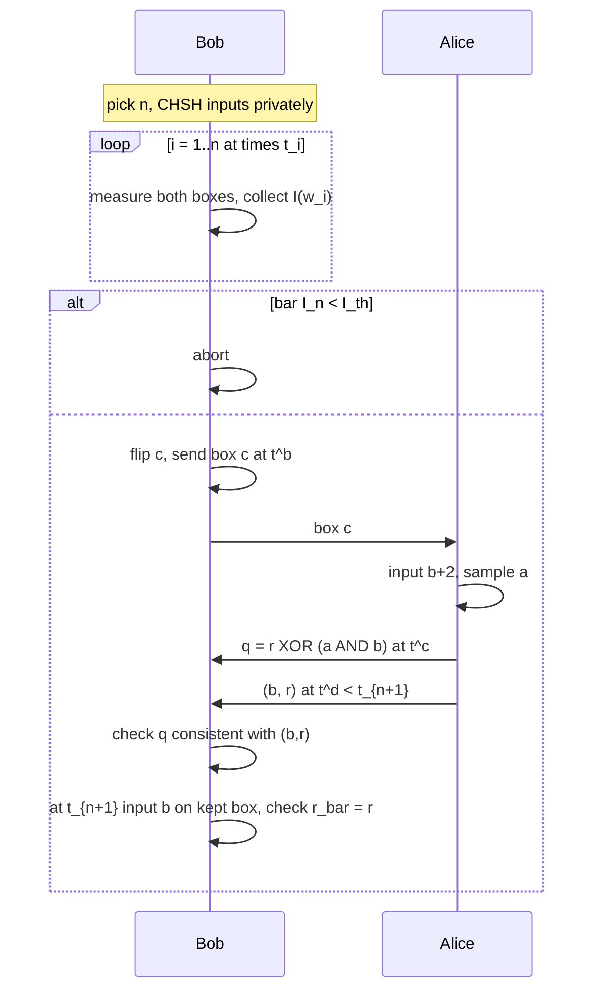

# 6. 协议

论文对应部分：§3。完成第 4–5 章之后再写协议。然后论证每一个随机选择和每一个时钟时刻为何必要。

## 6.1 参数

这是一族由以下参数索引的协议：

- 整数 $N>1$（CHSH 检验的最大次数）；
- 公开时刻 $t_1<\cdots<t_{N+1}$；
- 公开阈值 $I_{\mathrm{th}}$。

时间间隔 $t_{i+1}-t_i$ 必须足以完成：Bob $\to$ Alice 的量子传输、Alice 的测量、Alice $\to$ Bob 的经典消息传输（承诺*和*揭示），以及 Bob 在 $t_{i+1}$ 对保留盒子的测量。

论文脚注：只要区间剩余时间仍足以完成承诺+揭示，测量 $i+1$ 在 $(t_i,t_{i+1}]$ 中的某一时刻进行即可。

## 6.2 自己写出协议

仅使用下面给出的要素，写出一个三阶段协议，然后与论文比较。

**阶段 1——随机选择（Bob）。**

- 私下均匀选取 $n\in\{1,\dots,N\}$。
- 私下均匀选取 CHSH 输入 $\mathbf{s}^0_n,\mathbf{s}^1_n\in\{0,1\}^n$。
- 在每个 $t_i$，$i=1,\dots,n$，将 $s^i$ 输入盒子 $i$。
- 计算

  
$$
\bar I_n(\mathbf{w}_n)=\frac1n\sum_{k=1}^n I(w_k)
$$

  其中使用论文的指示函数 (4)（前因子为 4；参见习题 1.5）。
- 若 $\bar I_n<I_{\mathrm{th}}$，则中止。
- 否则抛硬币得到 $c\in\{0,1\}$，并在时刻 $t^b<t_{n+1}$ 将盒子 $c$ 发送给 Alice。

**阶段 2——承诺（Alice）。**

- 对比特 $b$，输入 $s^c_{n+1}=b+2$，得到 $r^c_{n+1}$。
- 私下均匀选取掩码（pad）$a\in\{0,1\}$。
- 在时刻 $t^c\in(t^b,t_{n+1})$ 发送 $q=r^c_{n+1}\oplus a b$。

**阶段 3——揭示（先 Alice，后 Bob）。**

- 在时刻 $t^d\in(t^c,t_{n+1})$，Alice 发送 $b$ 和 $r^c_{n+1}$。若 Bob 在 $t_{n+1}$ 之前未收到二者，则中止。
- 检查令牌（token）的一致性：仅当 $q=r^c$ 或 $q=r^c\oplus b$ 时接受。（为什么是“或”？因为 $q=r\oplus ab$，所以当 $b=0$ 时必须有 $q=r$；当 $b=1$ 时，$q=r$ 和 $q=r\oplus 1$ 都可能发生，具体取决于 $a$。）
- 在时刻 $t_{n+1}>t^d$，Bob 输入 $s^{\bar c}_{n+1}=s^c_{n+1}-2=b$；除非 $r^{\bar c}_{n+1}=r^c_{n+1}$，否则中止。

**习题 6.1。** 证明：若 Alice 诚实，则 $q=r^c\oplus ab$ 对于 $b$ 的两个取值总能通过令牌检查。

**习题 6.2。** 证明：若 Alice 诚实且盒子完美实现第 5 章中的表格，则在 CHSH 检验通过后，Bob 的最后一次检查总会成功，并输出被承诺的比特。（以阶段 1 未中止为条件的理想完备性。）

**习题 6.3。** 为什么 $q$ 是 Alice 输出的*一次一密（one-time pad）*版本，并且*仅在* $b=1$ 时加掩码？将其与 $P_{\mathrm{gain}}=3/4$ 联系起来：把 $q$ 当作 $r^c$ 的 Bob 在 $ab=0$ 时猜对，即有四分之三的概率猜对。

## 6.3 必须在正文中论证的两个设计约束

### 私密随机的 $n$

如果 Alice 知道 $n$，她就可以这样编程：第 $1,\dots,n$ 次使用采用 Tsirelson 设置；第 $n+1$ 次使用是确定性的，使她能够揭示两个比特中的任意一个。此时 Bob 的 CHSH 检验总会通过，而她有 $P_{\mathrm{cont}}=1$。

如果 $n$ 被隐藏，她唯一能够安全设为确定性的使用次数是第 $N+1$ 次，而这仅在 Bob 选取 $n=N$ 时发生，概率为 $1/N$。这就是 (11)–(19) 中 $+1/N$ 的来源。

### 固定时刻

保留的盒子绝不能在长时间延迟后看到一次“特殊”测量。如果 Bob 直到收到 Alice 的揭示后才测量保留盒子，该盒子就可能从违反 CHSH 的行为切换为确定性行为。

**习题 6.4。** 写出在时刻*不*固定时 Alice 的完美作弊策略。这一段正是该协议“并非严格意义上的 BC”的原因。

**习题 6.5。** 抛硬币仍然可行（习题 3.4）。若要让 Alice 真正自行选择揭示时刻，则需要附录 B 或 C。

## 6.4 中止语义（将其写入 §3）

- 阶段 1 中止：即使各方都诚实，也可能因统计波动发生。Bob 不能将其归咎于任何一方。
- 阶段 3 中止且诚实设备理想：若阶段 1 已通过，则不会发生。
- 阶段 3 中止且诚实设备含噪：以正概率发生。

## 6.5 协议流程图（在笔记中放入一个这样的版本）

## 检查点

合上本指南。凭记忆写出协议，包括每个时间标签和每项中止条件。如果漏掉掩码 $ab$、私密的 $n$ 或在 $t_{n+1}$ 进行的测量，就还没有准备好阅读证明。
