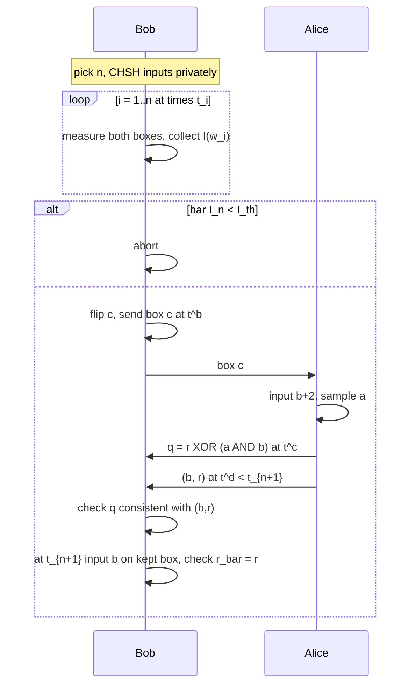

# 6. The protocol

Paper analogue: §3. Write the protocol only after chapters 4–5. Then justify every random choice and every clock tick.

## 6.1 Parameters

A family of protocols, indexed by:

- integer \(N>1\) (maximum number of CHSH tests);
- public times \(t_1<\cdots<t_{N+1}\);
- public threshold \(I_{\mathrm{th}}\).

The gaps \(t_{i+1}-t_i\) must be long enough for: Bob \(\to\) Alice quantum transmission, Alice’s measurement, Alice \(\to\) Bob classical messages (commit *and* reveal), Bob’s measurement of the kept box at \(t_{i+1}\).

Footnote in the paper: it is enough that measurement \(i+1\) occur at some time in \((t_i,t_{i+1}]\), provided the remainder of the interval still fits commit+reveal.

## 6.2 Write the protocol yourself

Using only the ingredients below, write a three-phase protocol. Then compare with the paper.

**Phase 1 — Random selection (Bob).**

- Private uniform \(n\in\{1,\dots,N\}\).
- Private uniform CHSH inputs \(\mathbf{s}^0_n,\mathbf{s}^1_n\in\{0,1\}^n\).
- At each \(t_i\), \(i=1,\dots,n\), input \(s^i\) into box \(i\).
- Compute

  \[
  \bar I_n(\mathbf{w}_n)=\frac1n\sum_{k=1}^n I(w_k)
  \]

  with the indicator (4) of the paper (prefactor 4; see Exercise 1.5).
- Abort if \(\bar I_n<I_{\mathrm{th}}\).
- Else flip a coin \(c\in\{0,1\}\), and at time \(t^b<t_{n+1}\) send box \(c\) to Alice.

**Phase 2 — Commit (Alice).**

- Bit \(b\). Input \(s^c_{n+1}=b+2\). Obtain \(r^c_{n+1}\).
- Private uniform pad \(a\in\{0,1\}\).
- At time \(t^c\in(t^b,t_{n+1})\), send \(q=r^c_{n+1}\oplus a b\).

**Phase 3 — Reveal (Alice then Bob).**

- At time \(t^d\in(t^c,t_{n+1})\), Alice sends \(b\) and \(r^c_{n+1}\). If Bob does not have them before \(t_{n+1}\), abort.
- Consistency of the token: accept only if \(q=r^c\) or \(q=r^c\oplus b\). (Why *or*? Because \(q=r\oplus ab\), so for \(b=0\) one must have \(q=r\), while for \(b=1\) both \(q=r\) and \(q=r\oplus 1\) are possible depending on \(a\).)
- At time \(t_{n+1}>t^d\), Bob inputs \(s^{\bar c}_{n+1}=s^c_{n+1}-2=b\) and aborts unless \(r^{\bar c}_{n+1}=r^c_{n+1}\).

**Exercise 6.1.** Prove that if Alice is honest, \(q=r^c\oplus ab\) always satisfies the token check, for both values of \(b\).

**Exercise 6.2.** Prove that if Alice is honest and the boxes implement the table of chapter 5 perfectly, then after a passing CHSH test Bob’s last check always succeeds and he outputs the committed bit. (Ideal completeness, conditioned on not aborting in Phase 1.)

**Exercise 6.3.** Why is \(q\) a *one-time-padded* version of Alice’s outcome, padded *only when* \(b=1\)? Connect this to \(P_{\mathrm{gain}}=3/4\): Bob who treats \(q\) as \(r^c\) is correct whenever \(ab=0\), i.e. three quarters of the time.

## 6.3 The two design constraints you must argue in the text

### Private random \(n\)

If Alice knows \(n\), she programs: uses \(1,\dots,n\) are Tsirelson; use \(n+1\) is deterministic and lets her open both bits. Bob’s CHSH test then always passes and she has \(P_{\mathrm{cont}}=1\).

If \(n\) is hidden, the only use she can safely make deterministic is use \(N+1\), which happens only when Bob picked \(n=N\), probability \(1/N\). That is the origin of the \(+1/N\) in (11)–(19).

### Fixed times

The kept box must not see a “special” measurement after a long delay. If Bob measured the kept box only *after* receiving Alice’s reveal, the box could switch from CHSH-violating to deterministic.

**Exercise 6.4.** Write Alice’s perfect cheat if times are *not* fixed. This paragraph is the reason the protocol is “not strictly BC”.

**Exercise 6.5.** Coin flipping still works (Exercise 3.4). For true Alice-chosen reveal time, you will need Appendix B or C.

## 6.4 Abort semantics (write this into §3)

- Phase-1 abort: possible even if everyone is honest (statistics). Bob cannot attribute it.
- Phase-3 abort with ideal honest devices: does not happen if Phase 1 passed.
- Phase-3 abort with noisy honest devices: happens with positive probability.

## 6.5 Protocol flowchart (put a version of this in your notes)

## Checkpoint

Close the guide. Write the protocol from memory, including every time label and every abort condition. If you miss the pad \(ab\), the private \(n\), or the measurement at \(t_{n+1}\), you are not ready for the proofs.
