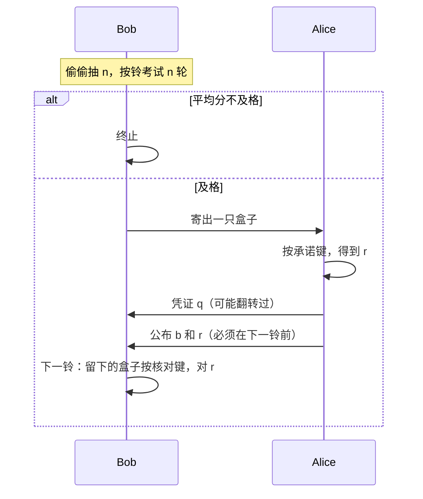

# 4. 协议故事：闹钟、抽签、寄盒子

下面用故事讲论文第 3 节。读完你应能向别人比划三步，即使还不会写公式。

## 4.1 道具

- 两只黑盒子，按钮 0,1,2,3，屏幕 0 或 1。
- 一只大家都看得见的**闹钟**，响铃时刻 $t_1<t_2<\cdots$ 事先写在纸上。
- 一个公开的及格线 $I_{\mathrm{th}}$（“CHSH 要打得够好”）。
- 一个事先约定的最大测试轮数 $N$（比如几十、几百）。

诚实时，两只盒子像一对默契搭档：用 0、1 键打 CHSH 能接近 85% 胜率；用另外的配对键则屏幕数字相同。

## 4.2 为什么要有闹钟

不诚实的 Alice 最怕什么？她希望：

- **考试时**（Bob 检查盒子神不神奇）盒子表现完美；
- **交卷时**（核对她有没有改口）盒子变成“听她的”，让她 0 和 1 都能开。

如果“核对”发生在一个盒子从没见过的晚间时段，盒子里的时钟会说：“哦，现在不是考试了。”于是她作弊满分。

所以：核对必须发生在**下一个公开铃**上，听起来和之前每一轮考试一模一样。盒子分不清“又一次 CHSH”和“抓改口”。

两个铃之间还要留够时间：寄量子系统、Alice 按键、把古典比特寄回、Bob 再按自己那只盒子。

## 4.3 三幕剧

### 第一幕：Bob 私下抽签，然后考试

Bob **偷偷**均匀随机抽一个整数 $n$（1 到 $N$）。Alice 不知道 $n$。

然后在 $t_1,\dots,t_n$ 每一响，他对两只盒子都只按 CHSH 用的 0 或 1，记下输赢，算出平均分 $\bar I_n$。

- 平均分低于及格线：他宣布失败，协议结束。（即使大家都诚实，偶尔也会因运气差发生；轮数很多时可以很少发生。）
- 及格：他抛一枚硬币，决定把**哪一只**盒子寄给 Alice，自己留下另一只。

**为什么 $n$ 必须保密：** 若 Alice 知道“就考 $n$ 轮”，她让前 $n$ 轮完美、第 $n+1$ 轮完全听她指挥。Bob 的考试永远及格，她永远能改口。

**她唯一稳能做手脚的一轮**是“第 $N+1$ 次使用”——因为那一轮永远不会拿来打 CHSH，只可能拿来核对。Bob 抽到 $n=N$ 的概率只有 $1/N$。这就是后文有一项 $1/N$ 的原因。

### 第二幕：Alice 封存

Alice 想封比特 $b$（0 或 1）。她在自己那只盒子上按承诺键（论文写成 $b+2$，意思是用 2 号键封 0、用 3 号键封 1）。屏幕跳出一位 $r$。

她再私下抛硬币得到 $a$，寄给 Bob 一个遮住的凭证

$$
q = r \oplus (a\cdot b).
$$

人话：

- 若她封的是 0，凭证就是屏幕上的 $r$（没遮）。
- 若她封的是 1，她用硬币决定要不要把 $r$ 翻转后再寄出。

所以 Bob 单看 $q$，不能确定 $b$——这是防偷看的第一道锁。但锁不完美：后面会看到 Bob 仍有 75% 机会猜对。

### 第三幕：Alice 打开，Bob 对答案

在下一个公开铃**之前**，Alice 必须寄出 $b$ 和当时的屏幕值 $r$。迟到则失败。

Bob 先查凭证是否对得上（封 0 时 $q$ 必须等于 $r$；封 1 时两种翻转都合法）。然后再在铃响时，用**留下的那只盒子**按核对键（就是 $b$ 本身）。两只盒子在这对按钮上应当给出**同一个** $r$。不对就抓作弊。

## 4.4 诚实时会发生什么

- 考试可能因统计波动失败（盒子其实很好，只是这一阵手气差）。Bob 无法区分“Alice 在骗”和“运气差”。$N$ 很大且及格线低于理想值时，这种乌龙会变少。
- 考试若过了，理想诚实盒子在揭示阶段**不会**再失败，Bob 得到的就是 $b$。
- 真实仪器有噪声：揭示阶段仍可能对不上，即使 Alice 没骗。任何实用协议都有这种烦恼，与“设备无关”无关。

## 4.5 严格说来这不算“随开随揭”的比特承诺

Alice **不能**自己选哪一天打开：打开时刻被闹钟钉死。对有的应用无所谓——例如用它掷硬币：Alice 封一比特，Bob 再寄一比特，到点打开，异或作为硬币。

若一定要让 Alice 想开就开，论文附录给了两种代价不同的改法（下一篇白话会讲）。

## 4.6 检查点

- 闹钟让“考试”和“抓改口”在盒子看来是同一种按键。
- $n$ 保密，否则 Alice 满分作弊。
- 凭证 $q$ 是“屏幕比特再随机遮一下”，遮法依赖她封的是不是 1。
- 最后 Bob 用留下的盒子对同一位 $r$。

下一节：不谈 SDP、不谈鞅，只说明两个数字 75% 和 85% 从何而来。
