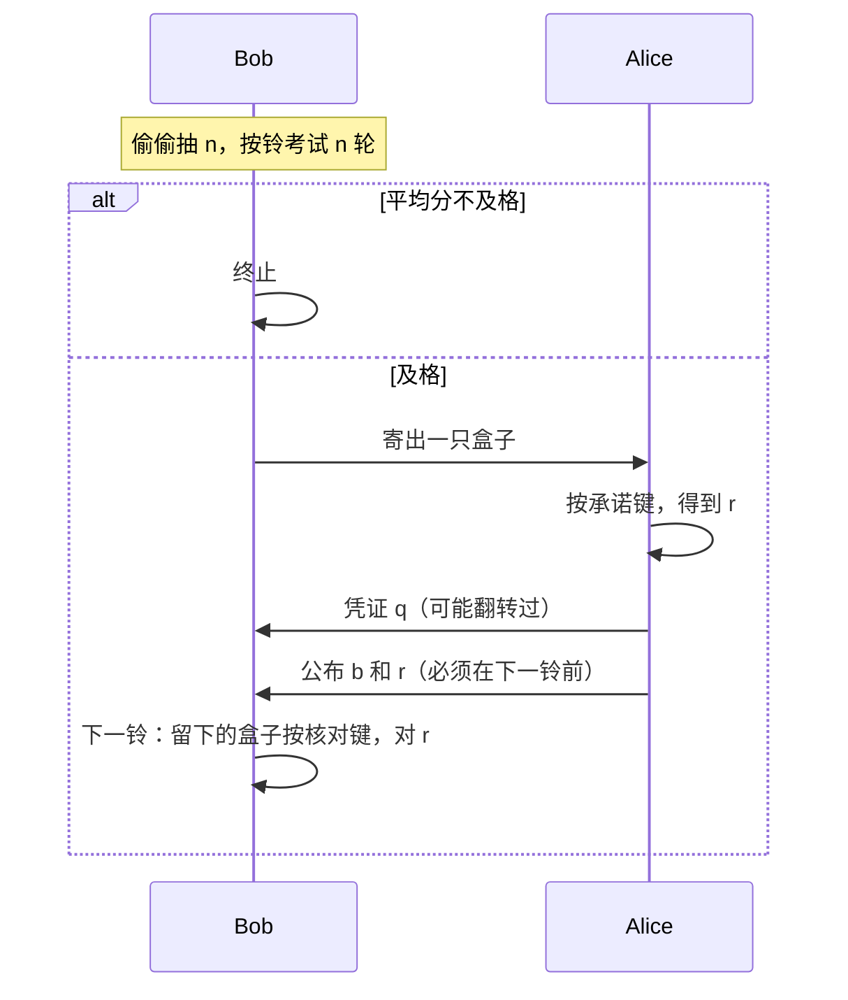

# 4. 协议故事：闹钟、抽签、寄盒子

下面用故事讲论文第 3 节。读完你应能向别人比划三步，即使还不会写公式。

## 4.1 道具

- 两只黑盒子，按钮 0,1,2,3，屏幕 0 或 1。
- 一只大家都看得见的**闹钟**，响铃时刻 $t_1<t_2<\cdots$ 事先写在纸上。
- 一个公开的及格线 $I_{\mathrm{th}}$（“CHSH 要打得够好”）。
- 一个事先约定的最大测试轮数 $N$。所需大小取决于阈值和目标安全参数；本文的有限轮界很保守，不能凭“几十或几百轮”断言已经足够安全。

诚实时，两只盒子像一对默契搭档：用 0、1 键打 CHSH 能接近 85% 胜率；用另外的配对键则屏幕数字相同。

“重复使用盒子”不表示反复测量同一对粒子。诚实实现可以在盒内预存很多对共享量子子系统，每轮消耗一对；盒子的控制器则可以保留跨轮记忆。安全证明允许这种长期记忆。

## 4.2 为什么要有闹钟

不诚实的 Alice 最怕什么？她希望：

- **考试时**（Bob 检查盒子神不神奇）盒子表现完美；
- **交卷时**（核对她有没有改口）盒子变成“听她的”，让她 0 和 1 都能开。

如果“核对”发生在一个盒子从没见过的晚间时段，盒子里的时钟会说：“哦，现在不是考试了。”于是她作弊满分。

所以：核对必须发生在**下一个公开铃**上，听起来和之前每一轮考试一模一样。盒子分不清“又一次 CHSH”和“抓改口”。

两个铃之间还要留够时间：寄量子系统、Alice 按键、把古典比特寄回、Bob 再按自己那只盒子。

### 两道防线解决的是不同攻击

| 防线 | 阻止盒子依据什么切换？ | 若去掉会怎样？ |
|---|---|---|
| 秘密随机 $n$ | “这是第几次使用” | 盒子预知第 $n+1$ 次是核验，按计数器切换 |
| 固定公开时刻 $t_i$ | “墙上时间 / 收到揭示后的特殊延迟” | 盒子把非正常时刻的测量识别为核验 |

两者缺一不可。秘密 $n$ 并不能阻止盒子看钟；固定时刻也不能阻止一个知道公开 $n$ 的计数器。

## 4.3 三幕剧

### 第一幕：Bob 私下抽签，然后考试

Bob **偷偷**均匀随机抽一个整数 $n$（1 到 $N$）。Alice 不知道 $n$。

然后在 $t_1,\dots,t_n$ 每一响，他分别、私下、均匀随机地给两只盒子各选一个 CHSH 输入 0 或 1，记下输出并计算平均分 $\bar I_n$。随机输入不能让盒子提前知道这一轮会被问哪一题。

- 平均分低于及格线：他宣布失败，协议结束。（即使大家都诚实，偶尔也会因运气差发生；轮数很多时可以很少发生。）
- 及格：他抛一枚硬币，决定把**哪一只**盒子寄给 Alice，自己留下另一只。

**为什么 $n$ 必须保密：** 若 Alice 知道“就考 $n$ 轮”，她让前 $n$ 轮完美、第 $n+1$ 轮完全听她指挥。Bob 的考试永远及格，她永远能改口。

对“按使用次数切换”的这类计数器攻击，第 $N+1$ 次使用是唯一可被盒子确定识别为非 CHSH 测试的一轮——它只可能用于核验。Bob 抽到 $n=N$ 的概率为 $1/N$，这解释了有限轮界中的显式 $1/N$ 项；一般攻击还会产生由统计集中控制的额外误差。

### 第二幕：Alice 封存

Alice 想封比特 $b$（0 或 1）。她在自己那只盒子上按承诺键（论文写成 $b+2$，意思是用 2 号键封 0、用 3 号键封 1）。屏幕跳出一位 $r$。

她再私下抛硬币得到 $a$，寄给 Bob 一个遮住的凭证

$$
q = r \oplus (a\cdot b).
$$

人话：

- 若她封的是 0，凭证就是屏幕上的 $r$（没遮）。
- 若她封的是 1，她用硬币决定要不要把 $r$ 翻转后再寄出。

所以 Bob 单看 $q$，不能确定 $b$——这是防偷看的第一道锁。但锁不完美：后面会看到 Bob 仍有 75% 机会猜对。

### 用八行穷举凭证（不要跳过）

$q=r\oplus(a\cdot b)$ 只有三个二进制变量，完全可以列完：

| $b$（承诺） | $a$（随机硬币） | $r$（盒子输出） | $a\cdot b$ | 发出的 $q$ |
|---:|---:|---:|---:|---:|
| 0 | 0 | 0 | 0 | 0 |
| 0 | 0 | 1 | 0 | 1 |
| 0 | 1 | 0 | 0 | 0 |
| 0 | 1 | 1 | 0 | 1 |
| 1 | 0 | 0 | 0 | 0 |
| 1 | 0 | 1 | 0 | 1 |
| 1 | 1 | 0 | 1 | 1 |
| 1 | 1 | 1 | 1 | 0 |

从表中读出：

- $b=0$ 时无论 $a$ 是什么，$q=r$；
- $b=1,a=0$ 时，$q=r$；
- $b=1,a=1$ 时，$q=r\oplus1$；
- 所以在均匀的 $(a,b)$ 四种组合中，三种“不翻转”、一种“翻转”。

这张表既解释了 Bob 的 $3/4$ 作弊策略，也解释了揭示时为什么检查“$q=r$ **或** $q=r\oplus b$”。

### 第三幕：Alice 打开，Bob 对答案

在下一个公开铃**之前**，Alice 必须寄出 $b$ 和当时的屏幕值 $r$。迟到则失败。

Bob 先查凭证是否对得上（封 0 时 $q$ 必须等于 $r$；封 1 时两种翻转都合法）。然后再在铃响时，用**留下的那只盒子**按核对键（就是 $b$ 本身）。两只盒子在这对按钮上应当给出**同一个** $r$。不对就抓作弊。

### 一个完整的诚实运行实例

取 $N=10$。Bob 私下抽到 $n=4$，所以在 $t_1,t_2,t_3,t_4$ 做四轮 CHSH。假设分数及格，他抛硬币得到 $c=0$，把盒子 0 寄给 Alice，留下盒子 1。

Alice 想承诺 $b=1$：

1. 她给盒子 0 输入 $b+2=3$；
2. 屏幕输出假设为 $r=0$；
3. 她的私人硬币假设为 $a=1$；
4. 所以 $q=0\oplus(1\cdot1)=1$，她先只寄 $q=1$；
5. 在 $t_5$ 前，她揭示 $(b,r)=(1,0)$；
6. Bob 检查 $q=r\oplus b=0\oplus1=1$，通过；
7. 在 $t_5$，Bob 给盒子 1 输入 $b=1$。诚实盒子的配对设置是 $(s^0,s^1)=(3,1)$，应输出相同结果；若盒子 1 输出 0，最终接受。

现在自己改两个地方再跑一遍：令 $b=0$；令 Bob 寄出盒子 1（$c=1$）。你应该发现核对输入仍是 $b$，而四种 $(c,b)$ 都有一对匹配设置。

### 谁知道哪些信息？

| 时刻 | Alice 知道 | Bob 知道 | 盒子可能知道 |
|---|---|---|---|
| 抽 $n$ 后 | 不知道 $n$ | $n$ 与所有 CHSH 输入 | 自己经历过几次使用，但不知道 Bob 会何时停止 |
| 发盒子后 | 自己收到哪只（可假设知道 $c$） | 自己保留哪只 | 自身历史、时钟、位置都可能知道 |
| 承诺后 | $a,b,r,q$ | $q$，但不知 $a,b,r$ | 各自局部输入输出 |
| 揭示后 | 已公开 $b,r$ | $b,r,q$ | Bob 留下的盒子只在预定时刻收到输入 $b$ |

安全性最依赖两项“不知道”：Alice 不知道秘密的 $n$；留下的盒子无法仅凭时间区分“普通测试轮”和“核验轮”。

## 4.4 诚实时会发生什么

- 考试可能因统计波动失败（盒子其实很好，只是这一阵手气差）。Bob 无法区分“Alice 在骗”和“运气差”。$N$ 很大且及格线低于理想值时，这种乌龙会变少。
- 考试若过了，理想诚实盒子在揭示阶段**不会**再失败，Bob 得到的就是 $b$。
- 真实仪器有噪声：揭示阶段仍可能对不上，即使 Alice 没骗。任何实用协议都有这种烦恼，与“设备无关”无关。

### 阈值不是越高或越低越好

提高 $I_{\mathrm{th}}$：通过的盒子更接近理想量子关联，Alice 更难改口；但诚实设备因噪声或统计波动被误杀的概率上升。降低阈值：诚实通过更容易，但 Bob 对 Alice 的安全保证变弱，因为控制函数 $C(I)$ 随允许的 CHSH 分数下降而上升。实际选择必须同时报告 $N$、诚实设备预期分数、阈值和目标安全界；本文主要给安全上界，不提供一套现成的工程参数。

## 4.5 严格说来这不算“随开随揭”的比特承诺

Alice **不能**自己选哪一天打开：打开时刻被闹钟钉死。对有的应用无所谓——例如用它掷硬币：Alice 封一比特，Bob 再寄一比特，到点打开，异或作为硬币。

若一定要让 Alice 想开就开，论文附录给了两种代价不同的改法（下一篇白话会讲）。

## 4.6 检查点

- 闹钟让“考试”和“抓改口”在盒子看来是同一种按键。
- $n$ 保密，否则 Alice 满分作弊。
- 凭证 $q$ 是“屏幕比特再随机遮一下”，遮法依赖她封的是不是 1。
- 最后 Bob 用留下的盒子对同一位 $r$。

下一节：不谈 SDP、不谈鞅，只说明两个数字 75% 和 85% 从何而来。
